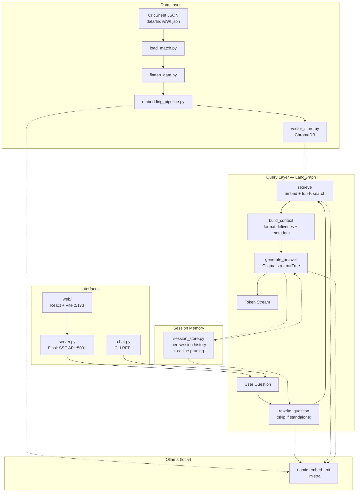

# MatchRAG — Full Application Architecture

> **Last updated:** 2026-03-07  
> **Purpose:** Comprehensive reference for AI agents and developers to understand the entire codebase without re-scanning.

---

## 1. Project Overview

**MatchRAG** is a local Retrieval-Augmented Generation (RAG) chatbot for cricket match analysis. It ingests CricSheet-format ball-by-ball JSON data, builds a ChromaDB vector index, and answers natural language questions using a LangGraph pipeline powered by Ollama (all local, no cloud APIs).

Supports **multi-turn conversations** (session memory with smart pruning) and **streaming responses** (SSE token-by-token output).

**Tech Stack:**

| Layer | Technology | Notes |
|-------|-----------|-------|
| Embeddings | Ollama (`nomic-embed-text`) | Runs locally |
| LLM | Ollama (`mistral`) | Runs locally |
| Vector Store | ChromaDB (persistent, cosine similarity) | Stored in `chroma_db/` |
| Pipeline Orchestration | LangGraph (`StateGraph`) | `rewrite_question → retrieve → build_context → generate_answer` |
| Session Memory | In-memory dict + cosine-similarity pruning | `rag/session_store.py` |
| Backend API | Flask + flask-cors | SSE streaming REST API on port 5001 |
| Frontend | React 19 + Vite 7 | Chat UI on port 5173 |
| Data Scraping | Python (requests + ThreadPoolExecutor) | ESPN Cricinfo mobile API |
| Testing | pytest | Unit tests for pipeline modules |
| Build/Tooling | Makefile, pyproject.toml, ruff | Python ≥ 3.10 |

---

## 2. Directory Structure

```
MatchRag/
├── config.py                  # Centralized configuration (models, paths, ports, memory)
├── server.py                  # Flask SSE streaming API server (entry-point)
├── chat.py                    # Interactive CLI chatbot (entry-point)
├── pyproject.toml             # Python project metadata & dependencies
├── Makefile                   # Dev commands (install, server, chat, test, lint, clean)
├── requirements.txt           # Pip dependencies (unpinned)
├── .env.example               # Environment variable template
├── BACKLOG.md                 # Production readiness backlog
├── README.md                  # Project readme
│
├── rag/                       # Core RAG pipeline package
│   ├── __init__.py            # Public API exports
│   ├── load_match.py          # Step 1: Load & validate CricSheet JSON
│   ├── flatten_data.py        # Steps 2-4: Flatten, detect events, build embedding text
│   ├── embedding_pipeline.py  # Step 5: Batch embed via Ollama
│   ├── vector_store.py        # Steps 6-7: ChromaDB index + semantic search
│   ├── rag_graph.py           # Steps 7-9: LangGraph pipeline (rewrite → retrieve → context → answer)
│   └── session_store.py       # Session memory: per-session chat history with smart pruning
│
├── web/                       # React frontend (Vite)
│   ├── package.json           # Node dependencies (React 19, Vite 7)
│   ├── index.html             # HTML entry-point
│   ├── vite.config.js         # Vite configuration
│   └── src/
│       ├── main.jsx           # React DOM root mount
│       ├── App.jsx            # Main app: session tracking, SSE streaming, New Chat button
│       ├── index.css          # Full design system (India-themed dark mode, glassmorphism)
│       └── components/
│           ├── ChatMessage.jsx      # Message bubble (supports progressive streaming render)
│           ├── ExampleChips.jsx     # Welcome screen starter chips
│           └── ThinkingIndicator.jsx # Animated loading dots
│
├── scripts/                   # Data collection utilities
│   ├── scrape_commentary.py   # Fetch ball-by-ball commentary from ESPN Cricinfo API
│   └── append_commentary.py   # Append fetched commentary into CricSheet JSON files
│
├── data/                      # Match data
│   ├── IndVsWI.json           # Primary match file (India vs West Indies, CricSheet format)
│   └── recently_added_30_male_json/  # Additional match JSON files
│
├── tests/                     # Test suite
│   ├── test_pipeline.py       # Unit tests: load_match, flatten_deliveries, detect_event
│   └── test_rag.py            # Smoke test for full RAG pipeline
│
├── docs/
│   └── architecture.md        # THIS FILE
│
└── chroma_db/                 # ChromaDB persistent storage (gitignored)
```

---

## 3. RAG Pipeline (Step-by-Step)

```
User Question
     │
     ▼
┌─────────────────────────────────────────────────────────────────────┐
│  INGESTION (runs once on first startup, or with --rebuild)          │
│                                                                     │
│  [1] load_match.py         → Load & validate CricSheet JSON        │
│  [2] flatten_data.py       → Flatten innings → overs → deliveries  │
│  [3] flatten_data.py       → Detect events (wicket/six/four/…)     │
│  [4] flatten_data.py       → Build natural-language embedding text  │
│  [5] embedding_pipeline.py → Batch embed text via Ollama           │
│  [6] vector_store.py       → Upsert into ChromaDB (cosine)         │
│                                                                     │
├─────────────────────────────────────────────────────────────────────┤
│  QUERY (runs on every question via LangGraph StateGraph)            │
│                                                                     │
│  [7] rag_graph.py:rewrite_question                                  │
│         → Heuristic check: is question a follow-up?                │
│         → If yes: call Ollama to rewrite into standalone query     │
│         → If no (standalone or no history): skip LLM call          │
│                                                                     │
│  [8] rag_graph.py:retrieve                                          │
│         → Embed rewritten question → top-K ChromaDB search         │
│                                                                     │
│  [9] rag_graph.py:build_context                                     │
│         → Format retrieved deliveries into structured prompt block  │
│         → Inject match-level metadata (match, venue, season)       │
│                                                                     │
│  [10] rag_graph.py:generate_answer                                  │
│         → Inject session chat_history into messages array          │
│         → Call Ollama (stream=True) → stream tokens to caller      │
│                                                                     │
└─────────────────────────────────────────────────────────────────────┘
     │
     ▼
  Tokens streamed to client (SSE) or returned as string (CLI)
```

---

## 4. Session Memory

Session memory enables follow-up questions by maintaining per-session chat history across turns.

### How It Works

1. The React frontend generates a `session_id` (UUID) on mount via `crypto.randomUUID()`.
2. Every `/api/ask` request includes `session_id`.
3. The server loads prior history from `session_store.py`, passes it to `ask_stream()`.
4. The LangGraph pipeline injects history into the `ollama.chat()` messages array.
5. After generation completes, the new Q&A turn is saved back to the session store.

### Smart Pruning (`rag/session_store.py`)

Rather than a simple FIFO cap, the store uses **cosine similarity pruning**:
- Always retains the most recent `MAX_HISTORY_TURNS` turns (safety net).
- For older turns, embeds both the current question and each older question via `nomic-embed-text`.
- Keeps older turns only if cosine similarity ≥ `HISTORY_RELEVANCE_THRESHOLD` (default: 0.6).
- This automatically drops irrelevant context when the user changes topics.

### Question Rewriting (`rag_graph.py:rewrite_question`)

Follow-up questions with vague references (e.g., "What over was that?", "How many runs did he score?") are rewritten into standalone queries before retrieval.

- **Heuristic check** first — no LLM call needed for standalone questions (no history, or no follow-up signals detected).
- **Follow-up detection** uses multi-word phrase signals ("he hit", "the bowler", "that over") and short-question word signals ("that", "him", "his" in ≤7-word questions).
- If rewrite is needed, Ollama resolves the references using recent history (last 6 messages).

---

## 5. Streaming (SSE)

Answers are now streamed token-by-token using **Server-Sent Events (SSE)**.

### Backend (`server.py`)

- `POST /api/ask` returns `Content-Type: text/event-stream` via Flask's `stream_with_context`.
- Calls `ask_stream()` which yields tokens from `ollama.chat(stream=True)`.
- Each token is sent as: `data: {"type": "token", "content": "..."}`.
- When generation completes: `data: {"type": "done", "elapsed": 1.23}`.
- On error: `data: {"type": "error", "message": "..."}`.

### Frontend (`App.jsx`)

- Uses `fetch()` with `response.body.getReader()` to consume the SSE stream.
- Renders tokens progressively into the bot message bubble as they arrive.
- Shows `ThinkingIndicator` only while the rewrite/retrieval phase is running (before first token).
- **New Chat button**: resets the `session_id`, clears UI messages, and calls `POST /api/session/clear` to purge server-side history.

---

## 6. Module Reference

### 6.1 `config.py` — Central Configuration

All settings overridable via environment variables:

| Constant | Default | Description |
|----------|---------|-------------|
| `EMBED_MODEL` | `nomic-embed-text` | Ollama embedding model |
| `LLM_MODEL` | `mistral` | Ollama LLM for answer generation |
| `CHROMA_PATH` | `chroma_db` | ChromaDB storage directory |
| `COLLECTION_NAME` | `cricket_commentary` | ChromaDB collection name |
| `TOP_K` | `15` | Number of deliveries to retrieve per query |
| `DATA_FILE` | `data/IndVsWI.json` | Default match JSON path |
| `MAX_HISTORY_TURNS` | `5` | Max Q&A turns retained per session |
| `HISTORY_RELEVANCE_THRESHOLD` | `0.6` | Cosine similarity cutoff for smart pruning |
| `API_PORT` | `5001` | Flask server port |
| `API_HOST` | `0.0.0.0` | Flask server bind address |

### 6.2 `rag/load_match.py`

- **`load_match(filepath) → dict`**: Load and validate CricSheet JSON.
- **`extract_metadata(data) → dict`**: Extract match-level metadata (teams, venue, season, winner).

### 6.3 `rag/flatten_data.py`

- **`flatten_deliveries(data) → list[dict]`**: Convert nested JSON into flat records with `id` and `text`.
- **`detect_event(delivery) → str`**: Classify into `wicket`, `six`, `four`, `dot`, `single`, or `run`.
- **`build_text(record) → str`**: Natural-language embedding text with full context.
- **`strip_html(text) → str`**: Remove HTML tags from commentary.

### 6.4 `rag/embedding_pipeline.py`

- **`embed_text(text) → list[float]`**: Single embedding via `ollama.embed()`.
- **`generate_embeddings(documents, batch_size=50)`**: Batch embed all delivery documents.
- **`check_model_available(model) → bool`**: Verify Ollama model is pulled locally.

### 6.5 `rag/vector_store.py`

- **`build_index(documents, embeddings, reset=False)`**: Upsert into ChromaDB with scalar metadata.
- **`query(question, n_results=15, where=None) → list[dict]`**: Embed question → top-K semantic search.
- **`collection_exists() → bool`**: Check if index has records.

**Stored metadata per delivery:** `match`, `innings`, `over`, `ball`, `batter`, `bowler`, `event`, `venue`, `season`, `batting_team`, `player_out`, `wicket_kind`, `wicket_fielder`, `runs_total`.

### 6.6 `rag/rag_graph.py` — LangGraph Pipeline

**State schema (`RAGState`):**
```python
{
  question:           str,   # original user question
  rewritten_question: str,   # standalone version (may equal question)
  chat_history:       list,  # [{role, content}, ...] prior turns
  retrieved_docs:     list,  # ChromaDB result dicts
  context:            str,   # formatted delivery context block
  answer:             str,   # final LLM answer (non-streaming path)
}
```

**Nodes:** `rewrite_question → retrieve → build_context → generate_answer`

**Public API:**
- **`ask(question, chat_history=[]) → str`**: Non-streaming (used by CLI).
- **`ask_stream(question, chat_history=[]) → Generator[str]`**: Yields tokens (used by Flask SSE).

**System prompt:** Strict factual rules — no hallucination, cite over/ball numbers, only use retrieved context, state uncertainty explicitly.

### 6.7 `rag/session_store.py` — Session Memory

```python
get_history(session_id) → list[dict]         # pruned history for a session
add_turn(session_id, question, answer)        # append Q&A, trigger smart prune
clear_session(session_id)                     # reset a session
```

Thread-safe (uses `threading.Lock`). Auto-initializes sessions via `defaultdict`.

### 6.8 `server.py` — Flask API Server

| Endpoint | Method | Description |
|----------|--------|-------------|
| `/` | GET | Health-check / service info |
| `/api/status` | GET | Index status + model info |
| `/api/ask` | POST | `{question, session_id?}` → SSE token stream |
| `/api/session/clear` | POST | `{session_id}` → clear session history |

- Auto-ingests on startup (skips if index exists).
- CLI args: `--file`, `--rebuild`, `--port`, `--host`.
- CORS enabled (blanket AllowAll).

### 6.9 `chat.py` — CLI Chatbot

- Interactive REPL with ANSI-colored output.
- Auto-ingests on startup. Shows example questions.
- Uses non-streaming `ask()`. Supports `quit`/`exit`/`q`/`:q`.

### 6.10 `web/` — React Frontend

- **Vite 7** dev server on port 5173, API at `http://localhost:5001`.
- **`App.jsx`**: Session ID lifecycle (`crypto.randomUUID` on mount), SSE streaming consumer (`ReadableStream` + `getReader()`), progressive token rendering, New Chat button.
- **`ChatMessage.jsx`**: Message bubble with streaming state awareness.
- **`ExampleChips.jsx`**: Welcome screen with 6 starter chips.
- **`ThinkingIndicator.jsx`**: Animated bouncing-dots (shown pre-first-token).
- **`index.css`**: India-themed dark mode (saffron/green gradients), glassmorphism panels, ambient animated orbs, New Chat button styles.

---

## 7. Data Format

**CricSheet JSON (input):**
```json
{
  "info": { "teams": [...], "venue": "...", "dates": [...], "outcome": {...} },
  "innings": [{ "team": "India", "overs": [{ "over": 0, "deliveries": [{
    "batter": "RG Sharma", "bowler": "AS Joseph",
    "runs": { "batter": 4, "extras": 0, "total": 4 },
    "wickets": [...], "commentary": "..."
  }]}]}]
}
```

**Flat delivery record (after `flatten_data.py`):**
```json
{
  "id": "inn1_ov1_b1", "match": "India vs West Indies",
  "innings": 1, "batting_team": "India",
  "over": 1, "ball": 1,
  "batter": "RG Sharma", "bowler": "AS Joseph",
  "event": "four", "runs_total": 4,
  "commentary": "...",
  "text": "Match: India vs West Indies at ... Over 1.1. ..."
}
```

---

## 8. Key Dependencies

**Python:** `langgraph`, `chromadb`, `ollama`, `flask`, `flask-cors`

**Node.js:** `react` ^19.2.0, `vite` ^7.3.1, `@vitejs/plugin-react` ^5.1.1

---

## 9. Development Commands

```bash
make install    # Create .venv and install dependencies
make server     # Start Flask SSE API on port 5001
make chat       # Start CLI chatbot
make test       # Run pytest
make lint       # Run ruff linter
make rebuild    # Force-rebuild ChromaDB index
make clean      # Remove caches, chroma_db, dist
```

```bash
cd web && npm install && npm run dev   # Start Vite dev server on port 5173
```

---

## 10. Known Limitations & Backlog

1. **Multi-Match Support**: Hardwired to single match file; no dynamic ingestion or cross-match search.
2. **Aggregate Queries**: Vector search cannot sum statistics (e.g., "how many runs did X score total"). A tool-augmented retrieval layer (metadata filtering + aggregation) is needed.
3. **API Security**: No auth, rate limiting, or production WSGI server.
4. **Testing & CI**: No API/integration tests, no CI pipeline.
5. **Session Persistence**: Session memory is in-memory only — lost on server restart.
6. **Dependency Pinning**: `requirements.txt` has no version pins.

---

## 11. Architecture Diagram


